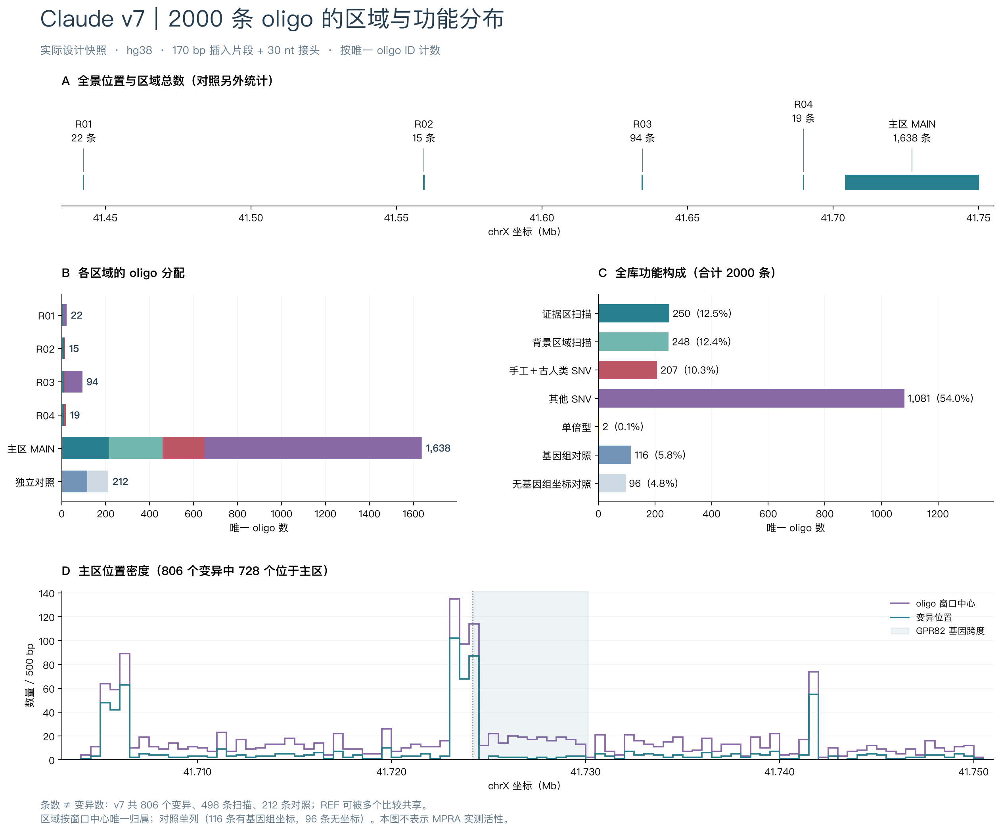
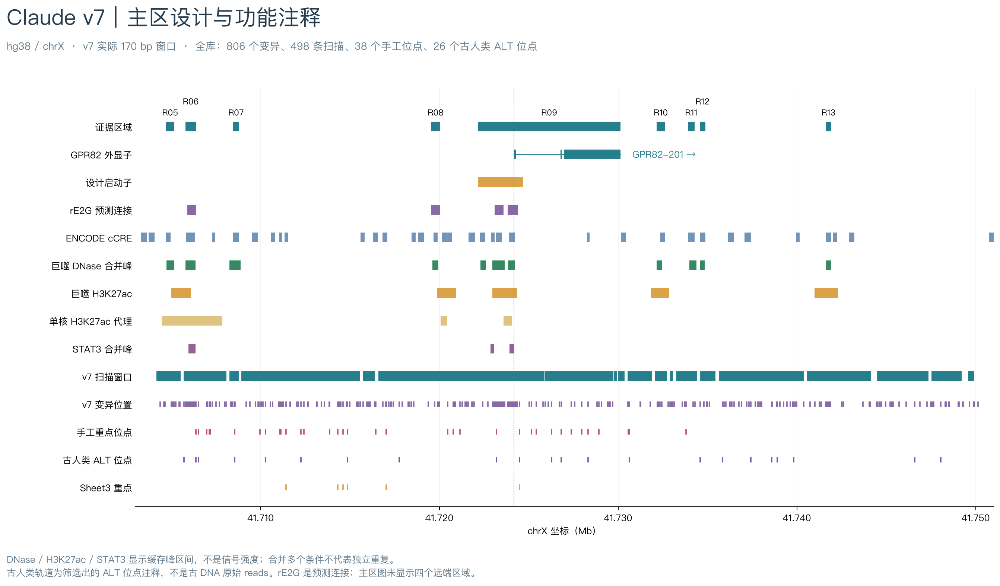
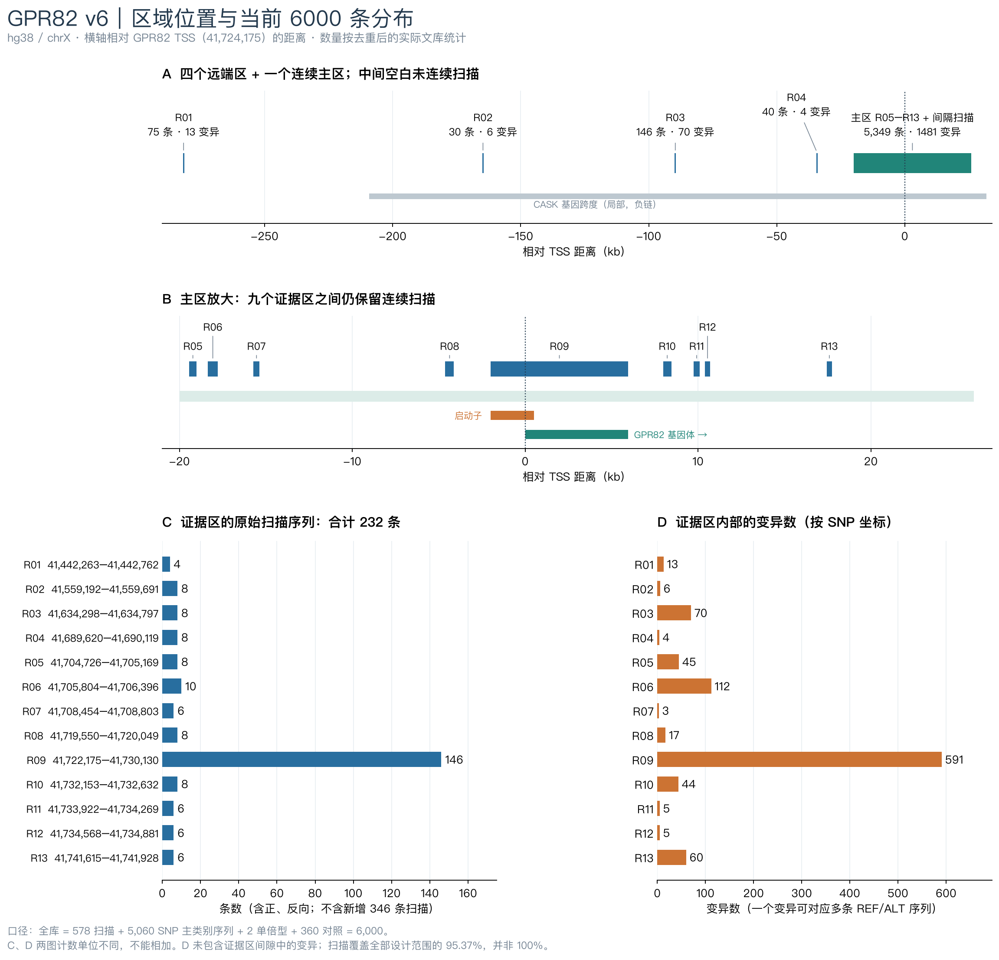
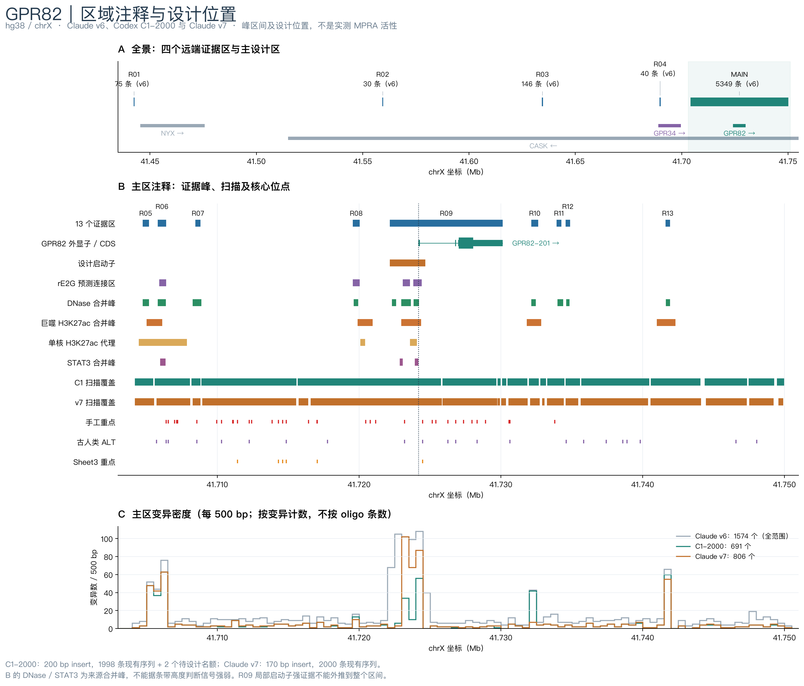
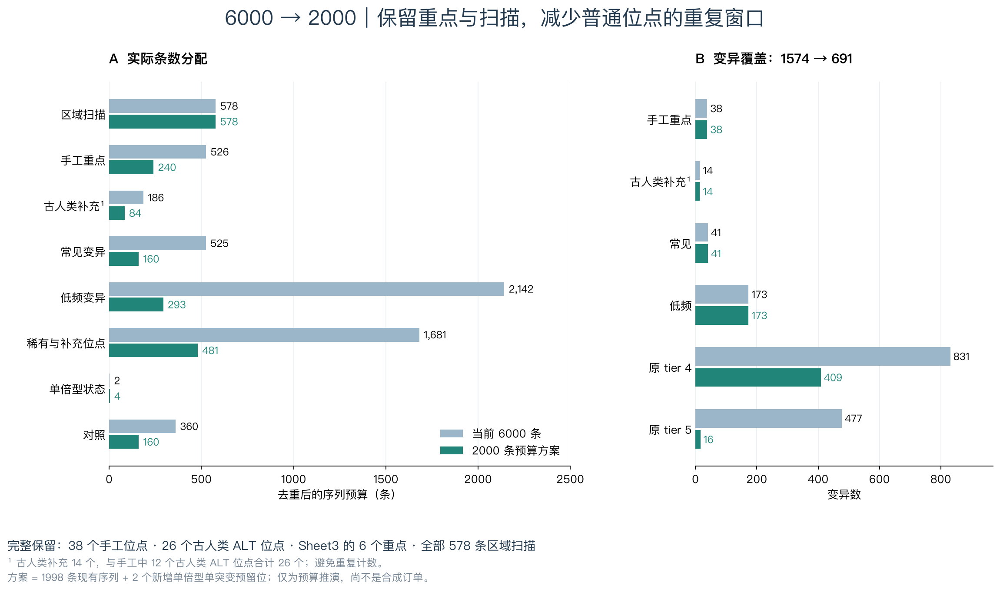

# GPR82 MPRA genome browser tracks (hg38)

包含 **Claude v6（6000 条）**、**Codex C1-2000（2000 条预算方案）**及 **Claude v7（2000 条实际设计）**。C1-2000 是此前称作 PLAN2000 的方案：1998 条现有序列加 2 个尚未设计的单倍型单突变名额，不是合成订单。v7 则是 2000 条、每条总长 200 nt、插入片段 170 bp 的实际文件。

C1 与 v7 的逐位点、逐区比较见 [比较报告](metadata/C1_vs_v7_comparison_zh.txt) 与 [比较数据](metadata/C1_vs_v7_summary.json)。

## Claude v7 专用图与浏览入口

v7 实际条数：R01 **22**、R02 **15**、R03 **94**、R04 **19**、主区 **1638**、对照 **212**，合计 **2000**。按唯一 oligo ID 的主类别计数；区域按窗口中心归属，对照单列。详细数据见 [JSON](metadata/v7_distribution_counts.json) / [CSV](metadata/v7_distribution_counts.csv)。

- [v7 UCSC 主区](https://genome.ucsc.edu/cgi-bin/hgTracks?db=hg38&hubUrl=https%3A%2F%2Fraw.githubusercontent.com%2FJiaGSLab%2FMPRA-GPR82-browser%2Fmain%2Fhub_v7%2Fhub.txt&position=chrX%3A41703000-41751000)
- [v7 UCSC 全景](https://genome.ucsc.edu/cgi-bin/hgTracks?db=hg38&hubUrl=https%3A%2F%2Fraw.githubusercontent.com%2FJiaGSLab%2FMPRA-GPR82-browser%2Fmain%2Fhub_v7%2Fhub.txt&position=chrX%3A41435000-41755000)
- [下载 v7 IGV 注释包](https://raw.githubusercontent.com/JiaGSLab/MPRA-GPR82-browser/main/GPR82_v7_IGV_with_annotations.zip)：解压后，在 IGV 的 File → Open Session 打开 `igv/GPR82_v7_local.xml`，参考基因组为 **hg38**，保留 tracks/ 相对目录。
- [v7 在线 IGV 会话](https://raw.githubusercontent.com/JiaGSLab/MPRA-GPR82-browser/main/igv/GPR82_v7_remote.xml)：下载 XML 后用 File → Open Session 打开，轨道从 GitHub 读取。

v7 专用 Hub 包含 27 个轨道，默认显示 25 个；包含 cCRE、五份巨噬细胞 DNase、巨噬 H3K27ac、单核 H3K27ac 代理、五个条件 STAT3、GPR82 基因模型、rE2G 和 26 个古人类 ALT 位点。注释是项目选定的局部缓存数据；古人类轨道为位点标记，不包含原始 reads/BAM。不会自动同步整个 ENCODE 数据库。密集 oligo 窗口与基因组对照默认隐藏，可按需打开。首次访问 UCSC 可能需要手动完成人机验证。

## 三版本比较：一键打开 UCSC

- [主区：GPR82 与附近证据](https://genome.ucsc.edu/cgi-bin/hgTracks?db=hg38&hubUrl=https%3A%2F%2Fraw.githubusercontent.com%2FJiaGSLab%2FMPRA-GPR82-browser%2Fmain%2Fhub%2Fhub.txt&position=chrX%3A41703000-41751000)
- [全景：四个远端区域 + 主区](https://genome.ucsc.edu/cgi-bin/hgTracks?db=hg38&hubUrl=https%3A%2F%2Fraw.githubusercontent.com%2FJiaGSLab%2FMPRA-GPR82-browser%2Fmain%2Fhub%2Fhub.txt&position=chrX%3A41435000-41755000)
- [备用：加载 BED custom tracks](https://genome.ucsc.edu/cgi-bin/hgTracks?db=hg38&position=chrX%3A41703000-41751000&hgct_customText=https%3A%2F%2Fraw.githubusercontent.com%2FJiaGSLab%2FMPRA-GPR82-browser%2Fmain%2Fucsc%2FGPR82_all_custom_tracks.bed)
- Hub URL: `https://raw.githubusercontent.com/JiaGSLab/MPRA-GPR82-browser/main/hub/hub.txt`

在线核查：GitHub 文件可访问，bigBed 支持 HTTP 206 分段读取；UCSC 页面当前触发人机验证，首次打开可能需要手动验证。图形页面尚未完成在线渲染确认。本地 36 个 BED/bigBed 回读和 IGV 会话路径检查已通过。

可在 UCSC 的 My Data → Track Hubs → My Hubs / Connected Hubs 输入 Hub URL。轨道下方可调整 dense/pack/full，灰色低优先级或密集窗口轨道默认隐藏，可按需打开。

## IGV

参考基因组选择 **Human hg38**。在线使用 File → Open Session，选择 URL 并粘贴：

`https://raw.githubusercontent.com/JiaGSLab/MPRA-GPR82-browser/main/igv/GPR82_remote_main.xml`

如果当前 IGV 版本只提供本地会话文件，下载 `igv/GPR82_remote_main.xml` 再打开，它会从 GitHub 加载轨道。
离线使用：下载整个仓库或 `GPR82_IGV_UCSC_bundle.zip` 并解压，再 File → Open Session 打开 `igv/GPR82_local_main.xml`；保持 igv/ 与 tracks/ 的相对目录。
`*_overview.xml` 从全景开始。基因组参考序列可能仍需要联网或已有 hg38 缓存。

## 图

## 轨道和解释

36 个轨道包含：五块设计范围、13 个证据区、邻近基因跨度、GPR82 外显子/CDS、启动子、rE2G 连接区间、cCRE、五份 DNase、巨噬 H3K27ac、单核细胞代理、五个 STAT3 条件、1574 个当前变异、38 个手工位点、26 个古人类 ALT 位点、6 个 Sheet3 重点、691 个拟保留变异、883 个未保留变异、232+346 条扫描、已有单倍型状态及两版基因组窗口。

- 所有 BED 为 **hg38，0-based 半开区间**；浏览器显示为 1-based。仅使用 GRCh38/hg38。
- 窗口表示插入片段：**v6 / C1 为 200 bp，v7 为 170 bp**；不包含 30 nt 接头。
- `gene_spans` 是基因跨度；`gpr82_transcripts` 才是真实缓存外显子模型。设计 TSS 为 41,724,175；canonical 转录本的缓存起点为 41,724,181。
- 证据轨道是已调用的 **峰区间**，不是测序信号强度；不同来源/条件不等于独立重复。
- R01/R02 的 cCRE 不在缓存查询范围内；未显示不是阴性。DNase/H3K27ac 来自复核后的原始峰求交。
- rE2G 是预测，MPRA 活性不能单独证明内源 GPR82 靶向。R09 启动子的证据不能外推到整个基因体。
- 古人类 ALT 是相对于 hg38 的样本非参考等位基因，不等于古人类特有或已证明渗入。
- 未输出没有基因组坐标的打乱和载体序列；具体数目见 metadata/export_summary.json。两个预留的新单突变没有冒充已完成轨道。
- 未将旧 motif “gain/loss”当作已验证差异结合证据展示。

## 区域跳转

- [R01：chrX:41,442,263–41,442,762](https://genome.ucsc.edu/cgi-bin/hgTracks?db=hg38&hubUrl=https%3A%2F%2Fraw.githubusercontent.com%2FJiaGSLab%2FMPRA-GPR82-browser%2Fmain%2Fhub%2Fhub.txt&position=chrX%3A41441762-41443262)
- [R02：chrX:41,559,192–41,559,691](https://genome.ucsc.edu/cgi-bin/hgTracks?db=hg38&hubUrl=https%3A%2F%2Fraw.githubusercontent.com%2FJiaGSLab%2FMPRA-GPR82-browser%2Fmain%2Fhub%2Fhub.txt&position=chrX%3A41558691-41560191)
- [R03：chrX:41,634,298–41,634,797](https://genome.ucsc.edu/cgi-bin/hgTracks?db=hg38&hubUrl=https%3A%2F%2Fraw.githubusercontent.com%2FJiaGSLab%2FMPRA-GPR82-browser%2Fmain%2Fhub%2Fhub.txt&position=chrX%3A41633797-41635297)
- [R04：chrX:41,689,620–41,690,119](https://genome.ucsc.edu/cgi-bin/hgTracks?db=hg38&hubUrl=https%3A%2F%2Fraw.githubusercontent.com%2FJiaGSLab%2FMPRA-GPR82-browser%2Fmain%2Fhub%2Fhub.txt&position=chrX%3A41689119-41690619)
- [R05：chrX:41,704,726–41,705,169](https://genome.ucsc.edu/cgi-bin/hgTracks?db=hg38&hubUrl=https%3A%2F%2Fraw.githubusercontent.com%2FJiaGSLab%2FMPRA-GPR82-browser%2Fmain%2Fhub%2Fhub.txt&position=chrX%3A41704225-41705669)
- [R06：chrX:41,705,804–41,706,396](https://genome.ucsc.edu/cgi-bin/hgTracks?db=hg38&hubUrl=https%3A%2F%2Fraw.githubusercontent.com%2FJiaGSLab%2FMPRA-GPR82-browser%2Fmain%2Fhub%2Fhub.txt&position=chrX%3A41705303-41706896)
- [R07：chrX:41,708,454–41,708,803](https://genome.ucsc.edu/cgi-bin/hgTracks?db=hg38&hubUrl=https%3A%2F%2Fraw.githubusercontent.com%2FJiaGSLab%2FMPRA-GPR82-browser%2Fmain%2Fhub%2Fhub.txt&position=chrX%3A41707953-41709303)
- [R08：chrX:41,719,550–41,720,049](https://genome.ucsc.edu/cgi-bin/hgTracks?db=hg38&hubUrl=https%3A%2F%2Fraw.githubusercontent.com%2FJiaGSLab%2FMPRA-GPR82-browser%2Fmain%2Fhub%2Fhub.txt&position=chrX%3A41719049-41720549)
- [R09：chrX:41,722,175–41,730,130](https://genome.ucsc.edu/cgi-bin/hgTracks?db=hg38&hubUrl=https%3A%2F%2Fraw.githubusercontent.com%2FJiaGSLab%2FMPRA-GPR82-browser%2Fmain%2Fhub%2Fhub.txt&position=chrX%3A41721674-41730630)
- [R10：chrX:41,732,153–41,732,632](https://genome.ucsc.edu/cgi-bin/hgTracks?db=hg38&hubUrl=https%3A%2F%2Fraw.githubusercontent.com%2FJiaGSLab%2FMPRA-GPR82-browser%2Fmain%2Fhub%2Fhub.txt&position=chrX%3A41731652-41733132)
- [R11：chrX:41,733,922–41,734,269](https://genome.ucsc.edu/cgi-bin/hgTracks?db=hg38&hubUrl=https%3A%2F%2Fraw.githubusercontent.com%2FJiaGSLab%2FMPRA-GPR82-browser%2Fmain%2Fhub%2Fhub.txt&position=chrX%3A41733421-41734769)
- [R12：chrX:41,734,568–41,734,881](https://genome.ucsc.edu/cgi-bin/hgTracks?db=hg38&hubUrl=https%3A%2F%2Fraw.githubusercontent.com%2FJiaGSLab%2FMPRA-GPR82-browser%2Fmain%2Fhub%2Fhub.txt&position=chrX%3A41734067-41735381)
- [R13：chrX:41,741,615–41,741,928](https://genome.ucsc.edu/cgi-bin/hgTracks?db=hg38&hubUrl=https%3A%2F%2Fraw.githubusercontent.com%2FJiaGSLab%2FMPRA-GPR82-browser%2Fmain%2Fhub%2Fhub.txt&position=chrX%3A41741114-41742428)

## 来源与复现

本地项目快照日期 2026-10-02；数据来源：Ensembl、ENCODE、GSE80727、GSE120943/ReMap2022 和本项目设计。来源与限制见 metadata/，逐轨道条数见 metadata/track_manifest.json。
生成器 `scripts/build_browser_bundle.py` 需要原 MPRA_GPR82 项目（大体积原始文件及合成序列未包含在此浏览仓库）。使用 UCSC bedToBigBed 生成，pybigtools 独立读取验证二进制轨道；使用 scripts/plot_annotation.py 从仓库 BED 绘图。

UCSC 官方文档：[Track Hubs](https://genome.ucsc.edu/goldenPath/help/hgTrackHubHelp.html) · [Custom Tracks](https://genome.ucsc.edu/goldenPath/help/customTrack.html)
